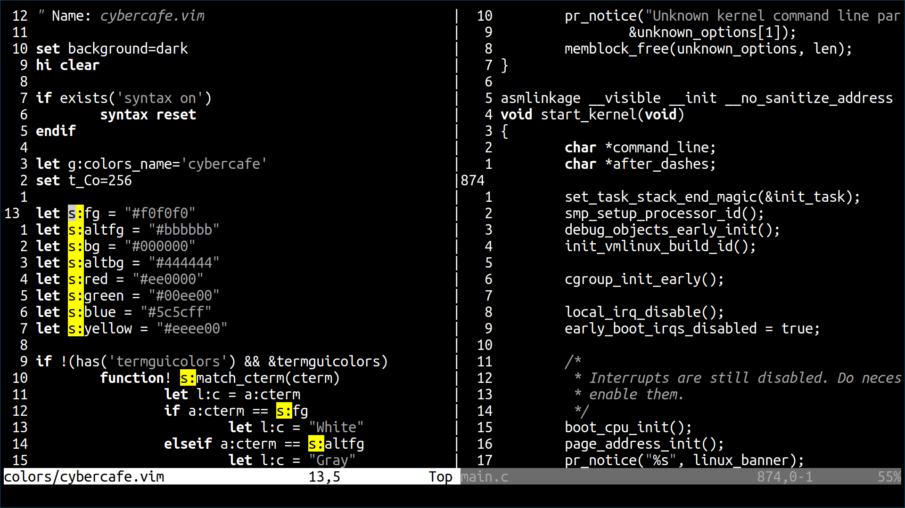

# Cyber Cafe Theme for Vim

Cyber Cafe is an almost colorless, white-on-black theme. Created for
distracion-less programming, knowing that syntax highlight is overrated.

If you set `g:cybercafe_soft`, a lighter gray background will be used instead of
the full black one.

Only compatibility for basic stuff added. No special support for any
plugin. Feel free to send a pull request if you add support for something!
